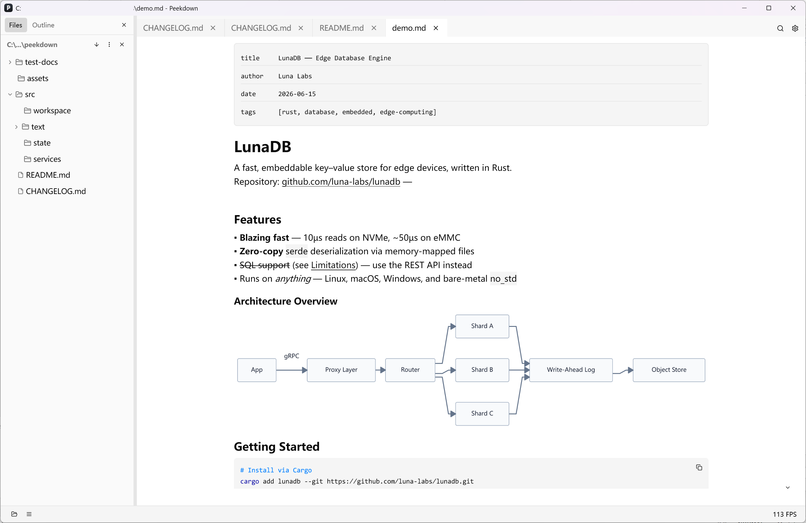

# Peekdown


A lightweight, native Markdown viewer built with Rust. Peekdown is designed to open Markdown files instantly and provide a distraction-free reading experience.

> **Note:** Peekdown currently supports Windows only. macOS and Linux support is planned.

---

## Features

- **Fast cold startup** – open files in under a second.
- **Single-instance app** – double-clicking a `.md` file opens it in the existing window as a new tab.
- **Native GPUI rendering** – smooth GPU-accelerated UI powered by [GPUI](https://github.com/zed-industries/zed).
- **GitHub Flavored Markdown** – tables, task lists, fenced code blocks, strikethrough, and more via `pulldown-cmark`.
- **Syntax highlighting** – code blocks rendered with `syntect`.
- **Mermaid diagram support** – render `mermaid` code blocks as flowcharts, sequence diagrams, and more.
- **Embedded HTML support** – handles tags like `<details>`, ``, `<kbd>`, etc.
- **Outline sidebar** – jump between headings quickly.
- **File explorer sidebar** – browse Markdown files in the current directory or project root.
- **In-document search** – find text inside the current document.
- **Auto-refresh** – watch files for changes and reload automatically.
- **Appearance settings** – light / dark / system theme, custom fonts, layout mode, zoom, and more.
- **Windows file association** – register `.md` files to open with Peekdown from Explorer.

---

## Screenshot



> A screenshot has not been captured yet — this is a placeholder.

---

## Installation

### Download prebuilt binary

Grab the latest release from [GitHub Releases](https://github.com/windedge/peekdown/releases).

### Build from source

```bash
cargo build --release
```

The executable will be located at `target/release/peekdown.exe`.

---

## Tech Stack

| Layer | Crate / Library |
|-------|-----------------|
| UI framework | GPUI + gpui-component |
| Markdown parsing | pulldown-cmark |
| Syntax highlighting | syntect |
| Async runtime | smol |
| Embedded HTML parsing | html5ever + markup5ever_rcdom |
| File watching | notify |
| IPC | interprocess |
| Diagram rendering | mermaid-rs-renderer |

---

## Build & Run

### Requirements

- [Rust](https://rust-lang.org/) toolchain (latest stable recommended)
- A Windows machine to build (the current implementation uses Windows APIs for IPC, window activation, and file association; cross-platform abstraction is planned)

### Run in development

```bash
cargo run
```

### Run with a Markdown file

```bash
cargo run --release -- path/to/file.md
```

### Build release binary

```bash
cargo build --release
```

The executable will be located at `target/release/peekdown.exe`.

---

## Register File Association (Windows)

Run the following command as Administrator to make Peekdown the default handler for `.md` files:

```bash
peekdown.exe --register
```

Or, from the project directory:

```bash
cargo run --release -- --register
```

This creates the necessary registry entries under `HKEY_CURRENT_USER\Software\Classes`.

---

## Configuration

Peekdown stores user settings in the platform config directory:

- Windows: `%APPDATA%\peekdown\config.toml`
- Linux: `~/.config/peekdown/config.toml`
- macOS: `~/Library/Application Support/peekdown/config.toml`

### Example `config.toml`

```toml
[appearance]
theme = "auto"               # "light", "dark", or "auto"
layout = "centered"          # "centered" or "full_width"
scroll_speed = 1.0
window_width = 1024.0
window_height = 768.0
font_family = ""
font_size = 16.0
mono_font_family = ""
mono_font_size = 13.0
inertia_scroll = true
show_fps = false
sidebar_visible = false
auto_refresh = true
```

---

## Keyboard Shortcuts

| Shortcut | Action |
|----------|--------|
| `Ctrl + O` | Open file dialog |
| `Ctrl + F` | Open search bar |
| `Esc` | Close search |
| `Ctrl + Tab` | Next tab |
| `Ctrl + Shift + Tab` | Previous tab |
| `Ctrl + W` | Close current tab |
| `Ctrl + +` | Zoom in font |
| `Ctrl + -` | Zoom out font |
| `Ctrl + 0` | Reset font size |
| `Ctrl + R` | Refresh current document |
| `Home` | Scroll to top |
| `End` | Scroll to bottom |

> Exact keybindings may evolve; refer to the in-app menu for the current bindings.

---

## Development

### Run tests

```bash
cargo test
```

### Run lints

```bash
cargo clippy -- -D warnings
```

---

## Contributing

Contributions are welcome. Please keep the following conventions:

- Code comments and UI text in English.
- Commit messages in English.
- Use `cargo check` and `cargo clippy` to verify changes.

---

## Known Limitations

- **Windows-only for now** – Peekdown is currently developed and tested on Windows. macOS and Linux support is planned for future releases.
- **IPC is Windows-tuned** – The single-instance mechanism uses Windows named pipes. A Unix socket equivalent is pending cross-platform work.
- **File association is Windows-specific** – The `--register` command creates Windows registry entries. No equivalent exists yet for macOS or Linux.
- **Planned features not yet implemented** – See [`docs/roadmap.md`](docs/roadmap.md) for features such as anchor jump, PDF export, and cross-platform support that are on the roadmap but not yet available.

---

## License

Peekdown is released under the [MIT License](LICENSE).
